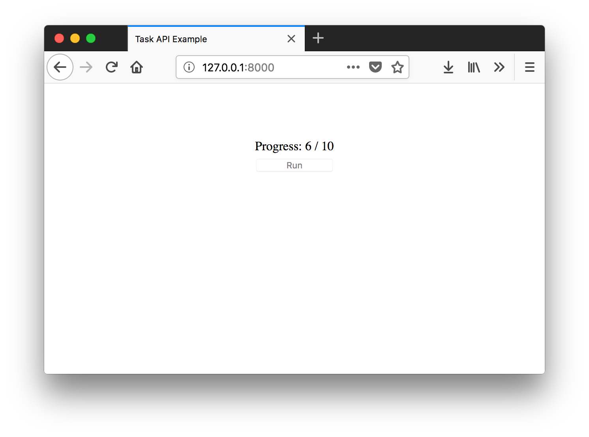

Getting Started
===============

Install Django Task API
--------------------------

Install the Python library with pip::

    $ pip install django-task-api

Django Task API is compatible and tested with Python versions 2.7, 3.5, 3.6, and 3.7, and with Django versions 1.11,
2.0, and 2.1.

Set up Celery
-------------
By default, Django Task API uses `Celery <http://www.celeryproject.org/>`_ to manage background tasks. If you're not
already using Celery, follow the
`First steps with Django <http://docs.celeryproject.org/en/latest/django/first-steps-with-django.html>`_
document to configure Celery for your project.

Create a task
-------------

Create a module in your Django app called `background.py` and add a task class to it:

.. code-block:: python
    :caption: myapp/background.py

    from time import sleep

    from task_api.params import IntParameter
    from task_api.tasks import Task

    class WaitTask(Task):
        name = 'wait'

        inputs = {
            'seconds': IntParameter(required=False)
        }

        def run(seconds=10):
            self.set_target(10)
            self.set_progress(0)

            for _ in range(seconds):
                sleep(1)
                self.inc_progress(1)

The ``WaitTask`` task accepts an integer value and counts toward that number, one second at a time. Since it updates its
progress, we'll be able to monitor it from the front-end.

Configure settings & URLS
-------------------------

Edit ``settings.py``, add the ``task_api`` app, and add tasks to ``TASK_API_BACKGROUND_TASKS``.

.. code-block:: python
    :caption: settings.py

    INSTALLED_APPS += [
        'task_api'
    ]

    TASK_API_BACKGROUND_TASKS = ['myapp.background.WaitTask']

With the app added to settings, run Django's migrate command::

    $ python manage.py migrate

We'll also need a URL route to the task API:

.. code-block:: python
    :caption: urls.py

    from django.conf.urls import url
    from django.urls import include

    urlpatterns = [
        url('^', include('task_api.urls'))
    ]

Add front-end Java Script
-------------------------

Django Task API includes a JS API for starting and monitoring background tasks. If you're using Django to manage your
static files, then you can include the library using the ```` template tag. You can also install the
JavaScript library from npm. For purposes of this walk through, let's create a template with some simple HTML and
JavaScript to start and monitor a task:

.. code-block:: django
    :caption: myapp/templates/task.html

    

    <!DOCTYPE html>
    <html lang="en">
    <head>
        <meta charset="UTF-8">
        <title>Task API Example</title>

        
        
        
    </head>
    <body>
        

            
Click "Run" to start the task.

            
<button onclick="startTask()" id="button">Run</button>

        

    </body>
    </html>

This gives the user a "Run" button, which when clicked, starts the task defined earlier. As the task counts towards
its target, the UI updates to show the current progress.

To finish everything out, we need to add a URL route for this template:

.. code-block:: python
    :caption: myapp/urls.py

    from django.conf.urls import url
    from django.urls import include
    from django.views.generic import TemplateView

    url_patterns = [
        # ... other URL patterns
        url('^$', TemplateView.as_view(template_name='example.html'))
    ]

If you haven't already, add your app to your project ``urls.py`` file:

.. code-block:: python
    :caption: urls.py
    :emphasize-lines: 6

    from django.conf.urls import url
    from django.urls import include

    urlpatterns = [
        url('^', include('task_api.urls')),
        url('^myapp', include('myapp.urls'))
    ]

Try it out
----------

Your new task should be ready to go. Make sure that the Django debug server and Celery worker process are both running,
then open the page in your browser. Click "Run" and watch your task progress.

Problems?
---------

If you run into problems, take a look at the fully-functional example project
`here <https://github.com/nikmolnar/django-task-api/tree/master/example/task_project>`_.
